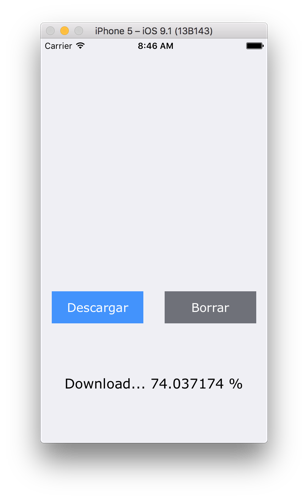
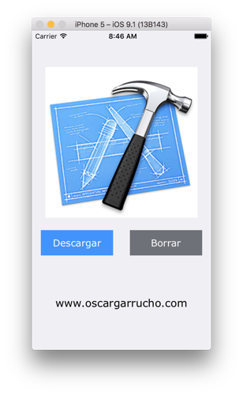

# NSURLSessionDownloadTask Project #

Proyecto a modo de ejemplo para un artículo de mi blog personal **sobre iOS && android**. 

En esta entrada escribo sobre como descargar una imagen y almacenarla en la carpeta interna de nuestra aplicación mediante **NSURLSessionDownloadTask**. Para esta ocasión, he decidido realizar el proyecto en `Objective-C`.

Para más información, visita mi blog: [www.oscargarrucho.com](http://oskarko.github.io/)